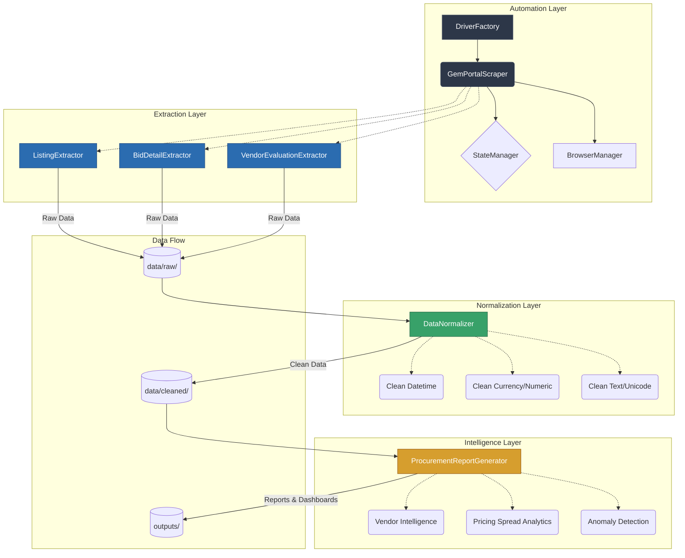

# System Architecture

The GeM Procurement Intelligence Platform is built on a highly decoupled, layered architecture to ensure maintainability, resilience, and scalability. By strictly separating the concerns of automation, extraction, cleaning, and reporting, the platform can easily adapt to upstream UI changes without breaking downstream data pipelines.

## Layered Architecture Diagram

## Core Components

### 1. Automation Layer (`scraper`)
Orchestrates the Selenium WebDriver. It handles explicit waits, dynamic DOM synchronization, retries, multi-tab navigation, and state checkpointing.
- **Resilience**: Uses `robust_click` and `find_element_with_fallback` to survive minor UI changes.
- **State Checkpointing**: Saves progress to `data/raw/scraper_state.json` after every page to enable crash recovery.

### 2. Extraction Layer (`extractor`)
Parses HTML elements into structured dictionaries.
- **Dynamic Mapping**: The `VendorEvaluationExtractor` uses synonym dictionaries (`_TECH_COL_SYNONYMS`, `_FIN_COL_SYNONYMS`) to map column headers dynamically instead of relying on hardcoded indexes.

### 3. Normalization Layer (`cleaner`)
The `DataNormalizer` standardizes the raw extracted data.
- **ISO 8601**: Converts varying date strings into strict ISO formats.
- **Schema Stability**: Ensures all output DataFrames have a fixed column schema, filling missing fields with `None` to prevent downstream SQL ingestion errors.

### 4. Intelligence Layer (`insights`)
The `ProcurementReportGenerator` analyzes the cleaned data to produce business value.
- **Anomaly Detection**: Identifies single-vendor bids, duplicated pricing, and abnormal spreads.
- **Dashboards**: Generates a static HTML dashboard and BI-ready CSVs.
